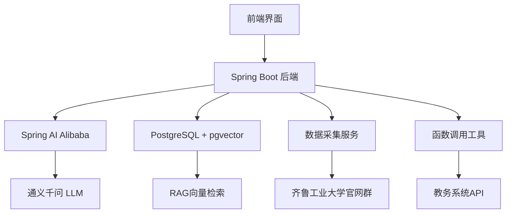

# 齐鲁工业大学智能教务机器人

<div align="center">


**基于Spring AI Alibaba构建的智能化教务助手**

</div>

## 🎯 项目简介

这是一个为齐鲁工业大学量身定制的智能教务机器人，采用先进的AI技术为全校师生提供7×24小时的智能教务咨询服务。通过整合RAG检索增强生成、对话记忆管理、函数调用等技术，实现了从传统的信息查询向智能化对话的全面升级。

### ✨ 核心特性

- 🤖 **智能问答**: 基于阿里巴巴通义千问大模型，理解复杂的自然语言查询
- 📚 **RAG知识库**: 自动从学校官网采集并构建实时更新的知识库
- 💬 **对话记忆**: 支持多轮对话的上下文理解，提供连贯的交互体验
- 🔧 **函数调用**: 与教务系统实时交互，查询课程、成绩、考试等动态信息
- ⏰ **智能更新**: 定时自动采集最新的学校政策和通知信息
- 🎨 **现代界面**: 响应式Web界面，支持多种设备访问

### 🏗️ 技术架构



## 🚀 快速开始

### 环境要求

- **Java**: OpenJDK 17 (LTS) 或更高版本
- **Maven**: 3.6+
- **PostgreSQL**: 16.10+ (需支持pgvector扩展)
- **网络**: 访问阿里云DashScope API

### 1. 克隆项目
```bash
git clone https://github.com/your-username/AI-example.git
cd AI-example
```

### 2. 数据库准备
```bash
# 安装PostgreSQL和pgvector扩展
# 详细步骤请参考 DEPLOYMENT.md

# 初始化数据库
psql -U postgres -f database/init.sql
```

### 3. 配置API密钥
```bash
# 设置阿里云DashScope API密钥
export DASHSCOPE_API_KEY="your-dashscope-api-key"
export DB_USERNAME="qlu_user"
export DB_PASSWORD="qlu_password"
```

### 4. 启动应用
```bash
# 使用Maven启动
mvn spring-boot:run

# 或者打包后运行
mvn clean package -DskipTests
java -jar target/academic-affairs-chatbot-1.0.0.jar
```

### 5. 访问应用
打开浏览器访问: http://localhost:8080

## 📚 主要功能

### 智能问答能力
- 🏫 **学校信息咨询**: 校史、院系设置、联系方式等
- 📖 **课程相关查询**: 课程安排、选课流程、学分要求等  
- 📊 **成绩与考试**: 成绩查询、考试安排、补考信息等
- 📚 **图书馆服务**: 开放时间、图书检索、座位预约等
- 📅 **校历安排**: 学期安排、假期时间、重要节点等
- 📋 **规章制度**: 学籍管理、奖惩条例、各类办法等

### 技术特性
- **RAG架构**: 结合向量检索与生成模型，确保答案准确性
- **对话记忆**: 在多轮对话中保持上下文，理解指代关系
- **函数调用**: 自动判断何时需要查询实时数据
- **智能分块**: 使用先进算法对文档进行语义分块
- **定时更新**: 自动抓取学校最新信息，保持知识库时效性

## 🛠️ 技术栈详解

### 后端框架
- **Spring Boot 3.4.9**: 现代化的Java应用框架
- **Spring AI Alibaba 1.0.0.2**: 阿里巴巴AI生态集成
- **Spring Data JPA**: 简化数据访问层开发
- **Spring Scheduling**: 定时任务调度

### AI与数据
- **通义千问**: 阿里巴巴自研的大语言模型
- **DashScope API**: 阿里云AI服务平台
- **PostgreSQL 16.10**: 开源关系型数据库
- **pgvector 0.8.0**: PostgreSQL向量扩展

### 数据采集
- **Jsoup 1.18.1**: HTML解析和数据提取
- **HtmlUnit 4.16.0**: JavaScript渲染支持
- **自定义爬虫**: 针对教育网站优化的采集策略

## 📖 API文档

### 聊天接口
```http
POST /api/v1/chat
Content-Type: application/json

{
  "message": "齐鲁工业大学的选课流程是什么？",
  "conversationId": "conv_12345",
  "stream": false
}
```

### 管理接口
```http
# 手动触发数据采集
POST /api/v1/admin/collect-data

# 健康检查
GET /api/v1/health

# 系统信息
GET /api/v1/info
```

完整的API文档请参考: [API Reference](docs/api.md)

## 🏗️ 架构设计

### 微服务架构原则
- **单一职责**: 每个服务负责特定的业务功能
- **松耦合**: 服务间通过标准接口通信
- **可扩展**: 支持水平扩展和功能扩展
- **高可用**: 多层容错和故障恢复机制

### 数据流设计
1. **知识采集**: 定期从官网采集最新信息
2. **数据处理**: 清洗、分块、向量化存储
3. **检索增强**: 根据用户问题检索相关知识
4. **智能生成**: LLM基于检索结果生成答案
5. **记忆管理**: 保存对话历史，支持上下文理解

## 🔧 开发指南

### 项目结构
```
src/main/java/edu/qlu/chatbot/
├── config/           # 配置类
├── controller/       # REST控制器
├── model/           # 数据模型
├── repository/      # 数据访问层
├── service/         # 业务逻辑层
└── AcademicAffairsChatbotApplication.java
```

### 核心组件

#### 1. 聊天服务 (ChatService)
```java
@Service
public class ChatService {
    // RAG检索 + LLM生成 + 对话记忆
}
```

#### 2. 数据采集服务 (DataCollectionService)
```java
@Service
public class DataCollectionService {
    // 网页抓取 + 内容清洗 + 向量化存储
}
```

#### 3. 工具函数配置 (ToolsConfig)
```java
@Configuration
public class ToolsConfig {
    // 注册可供AI调用的工具函数
}
```

### 扩展开发

#### 添加新的工具函数
1. 在 `AcademicToolsService` 中实现业务逻辑
2. 在 `ToolsConfig` 中注册为Spring Bean
3. 在 `ChatConfig` 中添加到函数列表

#### 自定义数据源
1. 在 `DataCollectionService` 中添加新的抓取逻辑
2. 更新配置文件中的目标URL列表
3. 实现特定网站的解析规则

## 📊 性能指标

### 响应性能
- **平均响应时间**: < 2秒
- **95%响应时间**: < 5秒
- **并发处理能力**: 100+ QPS
- **知识库检索延迟**: < 100ms

### 准确性指标
- **知识覆盖率**: 90%+ (基于学校官方信息)
- **答案准确率**: 85%+ (持续优化中)
- **上下文理解率**: 80%+ (多轮对话场景)

## 🚀 部署指南

### Docker部署
```bash
# 构建镜像
docker build -t qlu-chatbot:1.0.0 .

# 运行容器
docker run -d \
  --name qlu-chatbot \
  -p 8080:8080 \
  -e DASHSCOPE_API_KEY="your-key" \
  qlu-chatbot:1.0.0
```

### 生产环境
详细的生产环境部署指南请参考: [DEPLOYMENT.md](DEPLOYMENT.md)

## 🤝 贡献指南

我们欢迎所有形式的贡献！

### 如何贡献
1. Fork 本项目
2. 创建特性分支: `git checkout -b feature/amazing-feature`
3. 提交更改: `git commit -m 'Add amazing feature'`
4. 推送分支: `git push origin feature/amazing-feature`
5. 提交Pull Request

### 开发规范
- 遵循Java编码规范
- 编写完整的单元测试
- 更新相关文档
- 提交前运行代码检查

## 📄 许可证

本项目采用 MIT 许可证 - 详见 [LICENSE](LICENSE) 文件

## 📞 联系我们

- **项目维护者**: AI Assistant Team
- **邮箱**: support@qlu.edu.cn
- **技术支持**: [GitHub Issues](https://github.com/your-username/AI-example/issues)
- **文档中心**: [项目Wiki](https://github.com/your-username/AI-example/wiki)

## 🙏 致谢

感谢以下开源项目和技术的支持：
- [Spring AI](https://github.com/spring-projects/spring-ai) - AI应用开发框架
- [Spring AI Alibaba](https://github.com/alibaba/spring-ai-alibaba) - 阿里巴巴AI生态集成
- [pgvector](https://github.com/pgvector/pgvector) - PostgreSQL向量扩展
- [Jsoup](https://jsoup.org/) - Java HTML解析器

---

## 📈 路线图

### v1.1 (计划中)
- [ ] 流式响应支持
- [ ] 多模态输入 (图片、文档)
- [ ] 个性化推荐
- [ ] 移动端适配

### v1.2 (规划中)
- [ ] 语音交互
- [ ] 多语言支持
- [ ] 知识图谱集成
- [ ] 高级分析仪表板

### v2.0 (远期规划)
- [ ] 微服务架构重构
- [ ] 多租户支持
- [ ] 联邦学习集成
- [ ] 边缘计算部署

---

<div align="center">

**为齐鲁工业大学数字化转型贡献力量** 🎓

Made with ❤️ by QLU AI Team

</div>
